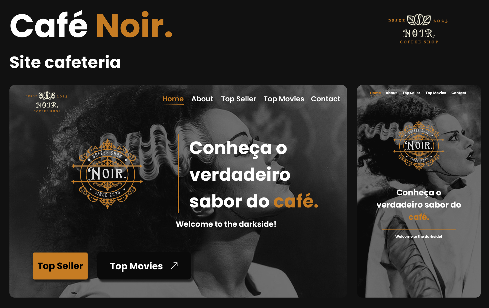

# ☕ Cafeteria Noir 
Café Noir é um projeto de uma landing page focada em filmes antigos e retros. 



## 💻 Sobre o Projeto
Esse projeto foi idealizado e desenvolvivo para uma cafeteria ficticia chamada Noir, inspirada na nostalgia dos filmes clássicos e na atmosfera do passado. Utilizamos de design moderno e elementos retrô, tons neutros e quentes, um cardápio dos itens mais famosos homenageando filmes antigos.


## 🎨 Layout
Criamos um layout no figma para orientar o desenvolvimento do projeto.
- [Figma](https://www.figma.com/file/kzZKZnG1ThDuDhjgyqMdoH/Caf%C3%A9-Noir?type=design&node-id=0%3A1&mode=design&t=CL9BzkU6rvEJLmsK-1)


## ⌨️ Funcionalidades
**1)** Design Responsivo: A página se adapta a diferentes tamanhos de tela, proporcionando uma experiência consistente em dispositivos móveis, tablets e desktops.

**2)** Apresentação Visual: Utilizamos imagens e elementos visuais inspirados em filmes antigos para criar uma atmosfera nostálgica e atraente.

**3)** Slider: Apresentamos os produtos, comidas e bebidas em um slider para facilitar a visualização do usuario

**4)** Catálogo de Filmes: Apresentamos aos visitantes uma seleção dos filmes antigos mais icônicos, juntamente com suas sinopses e pôsteres, para despertar o interesse e a curiosidade.


## 🛠 Tecnologias
As seguintes ferramentas foram usadas na construção do projeto:
- 
- 
- 


## 🖌️ Como usar
```bash
    Abra o arquivo 'index.html' no seu navegador com live server.
```
